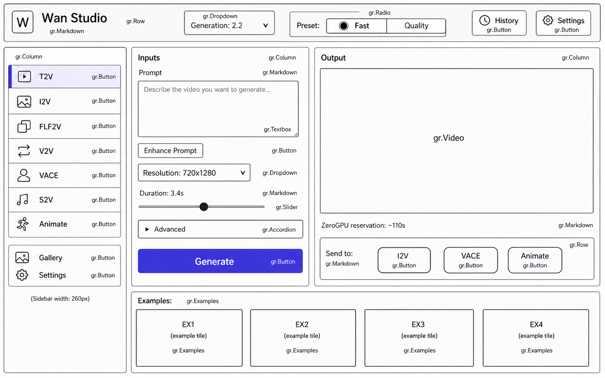
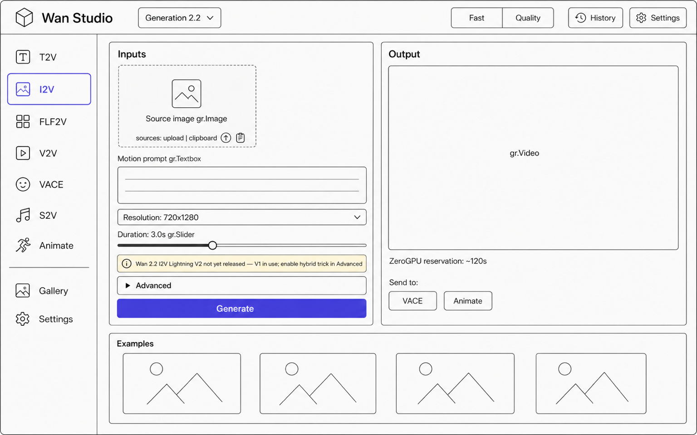
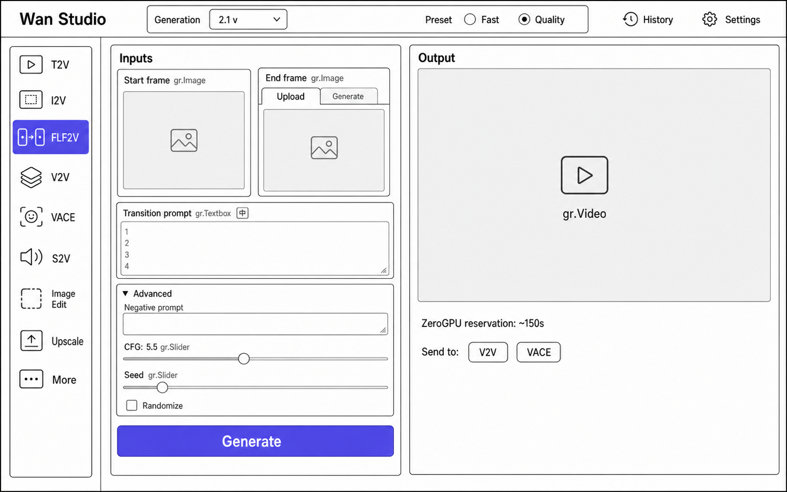
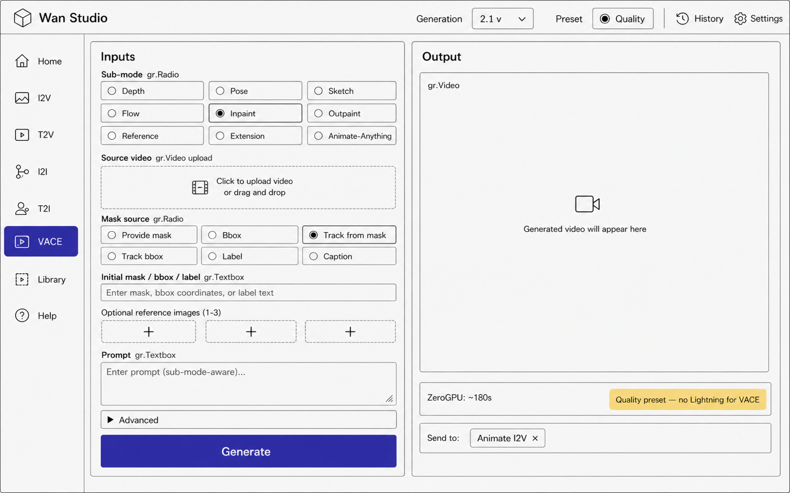
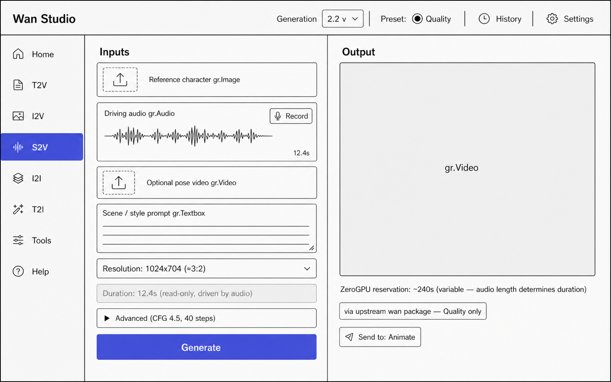
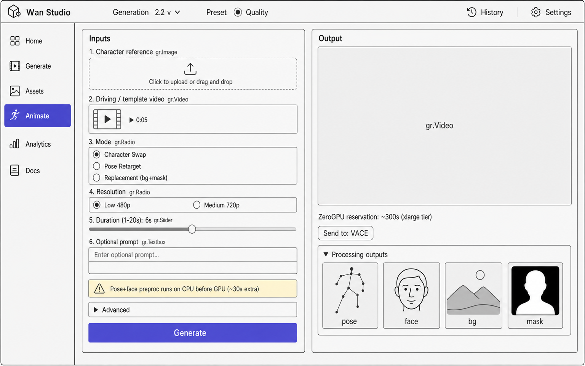
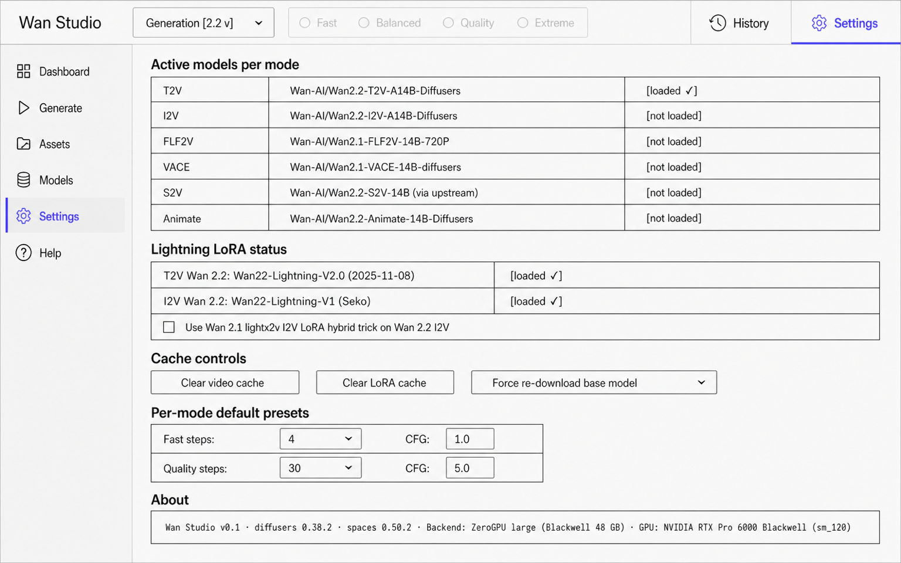
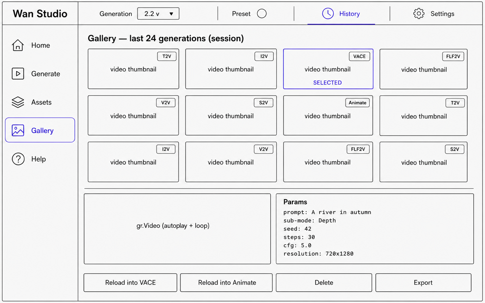

# Wan Studio — Research & Architecture Brief

> **Audience:** the dev (you) about to build a multi-mode Gradio Studio over the Alibaba Wan video diffusion family, deploying to Hugging Face ZeroGPU and running locally on Apple Silicon (M5 Max, 128 GB unified memory).
>
> **Date compiled:** 2026-05-21. Everything below was verified against live HF / GitHub / docs sources between May 18-21 2026; the raw per-topic research files in `raw/` cite every claim.
>
> **TL;DR**
> - Only **Wan 2.1** and **Wan 2.2** have **open weights**. Wan 2.5 / 2.6 / 2.7 are **API-only** despite blog claims.
> - Diffusers exposes **5 Wan pipeline classes** covering T2V, I2V, FLF2V (via `last_image=`), V2V, VACE, Animate. **TI2V-5B** and **S2V** are NOT in diffusers — vendor the upstream `wan` package.
> - **ZeroGPU hardware switched to NVIDIA RTX Pro 6000 Blackwell on 2026-05-13** (8 days ago). 48 GB (`large`) / 96 GB (`xlarge`). 14B + Wan 2.2 MoE require FP8 + AOTI on `large`; bf16 fits comfortably on `xlarge`.
> - **Fast preset = Lightning LoRA + 4 steps + guidance=1.0**, available for T2V/I2V on both generations. **Quality preset** = no LoRA, 30 steps. VACE, S2V, TI2V-5B and Animate are **Quality-only** (no Lightning LoRA for those modes).
> - Wan 2.2 MoE LoRAs are a **HIGH+LOW pair**. Load with `load_into_transformer_2=True` (diffusers ≥ 0.38.0).
> - **UX**: left sidebar (mode) + top header (generation + preset toggle) + two-col main (input | output). Cross-mode "Send to" chips for chaining.

---

## Table of contents

1. [Reality check — what is and isn't open](#1-reality-check)
2. [Model inventory (open weights, May 2026)](#2-model-inventory)
3. [Modes — what each one does](#3-modes)
4. [Mode × Generation availability matrix](#4-mode--generation-matrix)
5. [Lightning LoRA coverage & Fast/Quality preset architecture](#5-lightning--presets)
6. [ZeroGPU runtime — the Blackwell switch and what it implies](#6-zerogpu)
7. [Per-backend loading recipe (MPS dev / ZeroGPU large / ZeroGPU xlarge)](#7-loading-recipe)
8. [Multi-mode swap strategy on a single Space](#8-swap-strategy)
9. [Studio UX architecture](#9-ux-architecture)
10. [Wireframes — 8 screens](#10-wireframes)
11. [Implementation plan & sequencing](#11-impl-plan)
12. [Dependency matrix & version pins](#12-deps)
13. [Known unknowns & footguns](#13-footguns)
14. [Sources & raw research](#14-sources)

---

<a id="1-reality-check"></a>
## 1. Reality check — what is and isn't open

| Generation | Released | Open weights on Wan-AI HF org? | API endpoint? | Studio coverage |
|---|---|---|---|---|
| **Wan 2.1** | Feb–May 2025 | ✅ 7 checkpoint families, Apache 2.0 | n/a | First-class |
| **Wan 2.2** | Jul–Nov 2025 | ✅ 5 checkpoint families, Apache 2.0 | n/a | First-class |
| **Wan 2.5** | Announced Sep 2025 | ❌ API-only (Alibaba Cloud Model Studio, WaveSpeed, Together AI) | ✅ | Future enum slot |
| **Wan 2.6** | Announced Dec 2025 | ❌ API-only | ✅ | Future enum slot |
| **Wan 2.7** | Announced Apr 2026 | ❌ API-only | ✅ Together: `Wan-AI/wan2.7-t2v` etc | Future enum slot |
| **Wan 3.0** | Pre-announce, mid-2026 target | ❌ | ❌ | TBD |

**Important contradiction in the wild:** several third-party blog posts (mindstudio.ai, cliprise.app, etc.) describe Wan 2.5 / 2.7 as "open source Apache 2.0 with weights on Hugging Face." **This is not verifiable against the live `huggingface.co/Wan-AI` org listing as of 2026-05-21.** The Wan-Video GitHub org has only `Wan2.1` and `Wan2.2` repos. Together AI's `Wan-AI/wan2.7-*` references are **API endpoint identifiers**, not HF repos. Plan the Studio around Wan 2.1 + 2.2 today and architect a `Generation` enum so newer generations can slot in cleanly.

---

<a id="2-model-inventory"></a>
## 2. Model inventory (open weights, May 2026)

### Wan 2.1 (Feb–May 2025) — 7 checkpoint families, single dense DiT, shared Wan-VAE (8×8×4)

| HF repo | Params | Modality | Native rez | Frames | dtype | Diffusers class | Min diffusers |
|---|---|---|---|---|---|---|---|
| `Wan-AI/Wan2.1-T2V-1.3B-Diffusers` | 1.3B | T2V | 480p | 81 | bf16 | `WanPipeline` | 0.33.0 |
| `Wan-AI/Wan2.1-T2V-14B-Diffusers` | 14B | T2V | 480p / 720p | 81 | bf16 | `WanPipeline` | 0.33.0 |
| `Wan-AI/Wan2.1-I2V-14B-480P-Diffusers` | 14B | I2V | 480p | 81 | bf16 | `WanImageToVideoPipeline` | 0.33.0 |
| `Wan-AI/Wan2.1-I2V-14B-720P-Diffusers` | 14B | I2V | 720p | 81 | bf16 | `WanImageToVideoPipeline` | 0.33.0 |
| `Wan-AI/Wan2.1-FLF2V-14B-720P-diffusers` | 14B | FLF2V | 720p | 81 | bf16 | `WanImageToVideoPipeline` + `last_image=` | 0.34.0 |
| `Wan-AI/Wan2.1-VACE-1.3B-diffusers` | 1.3B | VACE (25+ sub-modes) | 480p | 81 | bf16 | `WanVACEPipeline` | 0.34.0 |
| `Wan-AI/Wan2.1-VACE-14B-diffusers` | 14B | VACE | 480p / 720p | 81 | bf16 | `WanVACEPipeline` | 0.34.0 |

Wan 2.1 shared properties: UMT5-XXL text encoder, CLIP-ViT-H/14 image encoder for I2V/FLF2V, `AutoencoderKLWan` VAE (3D causal, 8×8×4 compression), UniPCMultistepScheduler with `flow_shift=3.0` (480p) / `5.0` (720p). Frame count obeys `4·k+1` (VAE temporal stride = 4).

### Wan 2.2 (Jul–Nov 2025) — 5 checkpoint families, mixed dense / MoE

| HF repo | Params | Modality | Native rez | Frames @ fps | dtype | Diffusers class | Min diffusers |
|---|---|---|---|---|---|---|---|
| `Wan-AI/Wan2.2-TI2V-5B-Diffusers` | 5B dense | TI2V (T2V + I2V unified) | 1280×704 / 704×1280 only | 121 @ 24 fps | bf16 / VAE fp32 | **NOT in `diffusers.pipelines.wan/__init__.py`** — use upstream `wan.WanTI2V` | 0.35.0 (catalogued only) |
| `Wan-AI/Wan2.2-T2V-A14B-Diffusers` | 27B total / **14B active** (MoE) | T2V | 480p / 720p | 81 @ 24 fps | bf16 | `WanPipeline` (`transformer` + `transformer_2`) | 0.35.0 |
| `Wan-AI/Wan2.2-I2V-A14B-Diffusers` | 27B total / 14B active (MoE) | I2V | 480p / 720p | 81 @ 24 fps | bf16 | `WanImageToVideoPipeline` (`transformer` + `transformer_2`) | 0.35.0 |
| `Wan-AI/Wan2.2-S2V-14B` | 14B | S2V (speech/audio-driven) | 480p / 720p | variable (chained ~5s clips) @ 24 fps | bf16 | **NOT in diffusers** — wrap upstream `wan` or DashScope | n/a |
| `Wan-AI/Wan2.2-Animate-14B-Diffusers` | 14B dense | Character animation + replacement | 720p | 77/segment @ 30 fps, multi-segment | bf16 | `WanAnimatePipeline` | 0.36.0+ (docs at 0.38.0) |

Wan 2.2 differences:
- **MoE A14B variants** use **two `WanTransformer3DModel` instances**: `transformer` (high-noise, early timesteps) and `transformer_2` (low-noise, late timesteps). Switching boundary at `boundary_ratio=0.875` (empirical, `WanPipeline.from_config` reads this from `model_index.json`). Two `guidance_scale` knobs (`guidance_scale` for high, `guidance_scale_2` for low). 27 GB total on disk, 14 GB active per step.
- **TI2V-5B** uses the **new Wan2.2-VAE** with 16×16×4 compression (4× spatial vs Wan 2.1 VAE). This is the only checkpoint that fits 720p @ 24 fps × 121 frames on consumer GPUs. **Same `AutoencoderKLWan` class** — only `config.json` differs (no separate Python class).
- **S2V-14B** ships a **bundled wav2vec2-large-xlsr-53-english** audio encoder inside the same HF repo (1.26 GB safetensors); no separate `transformers.from_pretrained` needed.
- **Animate-14B** is dense (not MoE), default `guidance_scale=1.0` (CFG-disabled), 30 fps output, multi-segment stitching native via `segment_frame_length`+`prev_segment_conditioning_frames`. Requires pre-processed pose+face videos (`ViTPose-H wholebody` + `YOLOv10-Medium` + `SAM2 Hiera Large` — ~2 GB extra weights, NOT bundled with diffusers).

### Notable third-party forks (NOT in main inventory)
The Studio targets full-precision Wan-AI canonical releases. For reference only:
- `alibaba-pai/Wan2.{1,2}-Fun-*` — official Alibaba PAI team (different from Wan-AI) — `-InP` inpainting and `-Control` (depth/pose/camera) variants on 1.3B/5B/A14B bases.
- `Kijai/WanVideo_comfy*` — community FP8/scaled safetensors + Lightning LoRA mirror (we *do* pull LoRAs from here, but not base weights).
- `city96/Wan2.*-GGUF` — CPU/low-VRAM quants.
- `Comfy-Org/Wan_2.1_ComfyUI_repackaged` — ComfyUI single-file format.
- `FastVideo/FastWan2.{1,2}-*` — Hao AI Lab's 3-step distilled full checkpoints (covered in §5).

---

<a id="3-modes"></a>
## 3. Modes — what each one does

Wan officially supports the following modes. Inputs are listed exhaustively because the parameter panel in the Studio is built per-mode.

### 3.1 T2V — Text-to-Video
- **Pipeline:** `WanPipeline`
- **Inputs:** `prompt` (UMT5-XXL, max 512 tokens), `negative_prompt`, `height`, `width`, `num_frames` (default 81, must satisfy `4k+1`), `num_inference_steps`, `guidance_scale` (Wan 2.1: 5.0; Wan 2.2 A14B: 3.0+4.0 high/low), `seed`.
- **Output:** Numpy frames `(num_frames, H, W, 3)`. Export via `diffusers.utils.export_to_video(frames, "out.mp4", fps=16)`.
- **Checkpoints:** `Wan2.1-T2V-1.3B`, `Wan2.1-T2V-14B`, `Wan2.2-T2V-A14B`.
- **Defaults:** 50 steps (2.1) / 40 steps (2.2 A14B). UniPCMultistepScheduler, flow_shift 3.0 (480p) / 5.0 (720p) / 12.0 (Wan 2.2 A14B `sample_shift`).
- **Native FPS:** 16 (Wan 2.1, Wan 2.2 A14B).

### 3.2 I2V — Image-to-Video
- **Pipeline:** `WanImageToVideoPipeline`
- **Inputs:** `image` (PIL / np / tensor, single reference frame), `prompt`, `negative_prompt`, `height`, `width`, `num_frames`, `num_inference_steps`, `guidance_scale`, optional `image_embeds` (precomputed CLIP embeddings).
- **Resolution rule:** Round H,W to multiples of `pipe.vae_scale_factor_spatial * pipe.transformer.config.patch_size[1]` (8 for 2.1, 16 for 2.2-5B). Standard helper: `aspect_ratio_resize(image, pipe, max_area=480*832)`.
- **Checkpoints:** `Wan2.1-I2V-14B-480P` (separate 480p ckpt), `Wan2.1-I2V-14B-720P` (separate 720p ckpt), `Wan2.2-I2V-A14B` (unified MoE).
- **Defaults:** 40 steps; Wan 2.2 `sample_shift=5.0`, `boundary_ratio=0.900`, dual CFG `(3.5, 3.5)`.

### 3.3 TI2V — Text+Image-to-Video (Wan 2.2 5B only)
- **Pipeline:** **Not exposed in `diffusers.pipelines.wan/__init__.py`** as of May 2026. Use upstream `wan.WanTI2V` directly (vendor the `wan` package). `Wan-AI/Wan-2.2-5B` Space is the canonical reference: `from wan import WanTI2V; model = WanTI2V(config=WAN_CONFIGS['ti2v-5B'], checkpoint_dir=...); model.generate(input_prompt, img, size, ...)`.
- **Inputs:** `prompt` (required), `image` (optional — when omitted degrades to T2V), `size` (one of `1280×704` or `704×1280` only).
- **Native config:** 121 frames @ 24 fps, 50 steps, `sample_guide_scale=5.0`, `sample_shift=5.0`, `vae_stride=(4,16,16)`.
- **Why it matters:** Only Wan 2.2 checkpoint that fits 720p @ 24 fps × 121 frames on a single consumer GPU. Native VAE 4×16×16 compression (64× total with patch layer).

### 3.4 FLF2V — First-Last-Frame-to-Video (Wan 2.1 only)
- **Pipeline:** `WanImageToVideoPipeline` with `last_image=` kwarg.
- **Inputs:** `image` (first frame), `last_image` (end frame), `prompt`, `negative_prompt`, `height`, `width`, `num_frames`, `num_inference_steps`, `guidance_scale=5.5` (per diffusers example).
- **Resolution helper:** `aspect_ratio_resize(first_frame, ...)` then `center_crop_resize(last_frame, H, W)` to match. **Output aspect ratio is the first frame's** — last frame is center-cropped to fit.
- **Checkpoint:** `Wan2.1-FLF2V-14B-720P` (720p only, trained on Chinese text-video pairs; Chinese prompts recommended).
- **Wan 2.2 alternative:** No dedicated FLF2V checkpoint; use VACE's First-Last-Frame sub-mode on Wan 2.1.

### 3.5 V2V (basic latent restyle) — `WanVideoToVideoPipeline`
- **Pipeline:** `WanVideoToVideoPipeline`
- **Inputs:** `video` (list of PIL frames), `prompt`, `negative_prompt`, `strength` (0.7-0.8 typical), height, width, steps, CFG.
- **What it is:** SD-style "noise + restyle" V2V — encode input video to latents, add noise proportional to `strength`, denoise with new prompt. **Not** controlled V2V — use VACE for that.
- **Backbone:** Reuses Wan 2.1 T2V checkpoints (no separate V2V checkpoint).

### 3.6 VACE — Versatile Animation Control & Editing (Wan 2.1 only — Wan 2.2 has no VACE checkpoint as of May 2026)
- **Pipeline:** `WanVACEPipeline` — single class, sub-mode controlled by what you supply for `video`, `mask`, `reference_images`.
- **Common inputs:** `prompt`, `video` (control frames or source frames), `mask` (per-frame; black = condition, white = generate), `reference_images` (1-3, for ID preservation), `conditioning_scale` (per-layer scaling possible).
- **25+ sub-modes:** Depth, Pose, Optical-flow, Grayscale, Scribble, Layout-BBox, Layout-Track, Inpaint (Mask/BBox/MaskTrack/BBoxTrack/Label/Caption), Outpaint, Reference-Face, Reference-Object, Extension (First/Last/First-Last/First-Clip/Last-Clip/First-Last-Clip), Reference-Anything, Animate-Anything, Swap-Anything, Expand-Anything, Move-Anything.
- **Preprocessing dependencies** (NOT bundled with diffusers — ship from `ali-vilab/VACE` repo, ~5 GB extras):
  - **DepthVideoAnnotator** → MiDaS dpt_hybrid
  - **PoseBodyFaceVideoAnnotator** → DWPose Wholebody
  - **FlowVisAnnotator** → RAFT
  - **InpaintingAnnotator / Layout-Track** → SAM2 + GroundingDINO + recognize-anything
  - **SubjectAnnotator** → InsightFace
- **Studio implementation note:** For ZeroGPU, two options: (a) ship only DWPose + MiDaS + RAFT (~1 GB), the lightweight subset, OR (b) accept user-pre-extracted control videos (depth/pose maps) directly in the UI and skip server-side preprocessing. The full ali-vilab/VACE annotator stack is too heavy for ephemeral disk.

### 3.7 S2V — Speech/Audio-to-Video (Wan 2.2 only — NOT in diffusers)
- **Pipeline:** **Not in diffusers.** Diffusers issue #12257 open, no PR. Two integration paths:
  1. Vendor upstream `wan` package, call `wan.WanS2V(...).generate(...)` — preferred for ZeroGPU.
  2. Shell out to official `generate.py --task s2v-14B` — simpler but harder to wrap in `@spaces.GPU`.
- **Inputs:** `audio` (WAV/MP3, 16 kHz target), `image` (reference character), `prompt` (scene/style), optional `pose_video` (driving pose), optional `num_clip` (chunk count; omit to auto-derive from audio length).
- **Audio encoder:** **wav2vec2-large-xlsr-53-english is bundled inside the HF repo** at `Wan-AI/Wan2.2-S2V-14B/wav2vec2-large-xlsr-53-english/`. No separate download needed. Hidden states (not CTC logits) interpolated to 30 fps internally; sampled output is 24 fps.
- **Native long-form output:** Only Wan mode with first-class variable-length generation. Each `~5s` clip is conditioned on the previous clip's tail frames (overlap-and-stitch).
- **Defaults:** 40 steps, CFG 4.5, sample_shift 3.
- **Optional:** CosyVoice TTS bundle (`requirements_s2v.txt`) for end-to-end text→audio→video.

### 3.8 Wan-Animate — Character animation + Replacement (Wan 2.2 only)
- **Pipeline:** `WanAnimatePipeline`
- **Two modes via `mode={"animate","replace"}`:**
  - **Animation** (default): Drive a reference character image with motion from pose+face videos.
  - **Replacement:** Replace the character in a background video while preserving the scene. Adds `background_video` + `mask_video` inputs and an optional Relighting LoRA (`--use_relighting_lora`, NOT to be used in `animate` mode).
- **Inputs:** `image` (character ref), `pose_video` (**pre-processed** skeletons, NOT raw video), `face_video` (**pre-processed** face crops with implicit features), optional `prompt`, optional `negative_prompt`. Plus `background_video`+`mask_video` for replace mode.
- **Defaults:** 20 steps, `guidance_scale=1.0` (CFG **disabled** by default), `sample_shift=5.0`, 30 fps, `segment_frame_length=77`, `prev_segment_conditioning_frames=1` (or 5 for smoother transitions, more VRAM).
- **Preprocessing bundle** (~2 GB, in `Wan-AI/Wan2.2-Animate-14B/process_checkpoint/`):
  - `pose2d/vitpose_h_wholebody.onnx` — ViTPose-H Wholebody (NOT DWPose — only Wan mode using ViTPose)
  - `det/yolov10m.onnx` — YOLOv10-Medium person detector
  - `sam2/sam2_hiera_large.pt` — SAM2 Hiera Large
  - Optional Flux model for off-axis pose retargeting (`--use_flux`)
- **Long-form output:** Built-in multi-segment stitching — segments chain via overlapping `prev_segment_conditioning_frames`. Effective frame yield = `ceil(len(pose_video) / 76) × 76 + 1`.

### 3.9 T2I — Text-to-Image (niche; Wan 2.1 unified)
- **Pipeline:** `WanPipeline` with `num_frames=1`.
- Use case: preview frame, design iteration. Likely not a primary Studio mode given purpose-built image models exist.

---

<a id="4-mode--generation-matrix"></a>
## 4. Mode × Generation availability matrix

✅ = first-class support, ⚠️ = supported with caveat, ❌ = no support / no checkpoint

| Mode | Wan 2.1 1.3B | Wan 2.1 14B | Wan 2.1 VACE (1.3B/14B) | Wan 2.2 TI2V-5B | Wan 2.2 T2V-A14B | Wan 2.2 I2V-A14B | Wan 2.2 S2V-14B | Wan 2.2 Animate-14B |
|---|---|---|---|---|---|---|---|---|
| **T2V** | ✅ | ✅ | — | ✅ (also T2V) | ✅ MoE | — | — | — |
| **I2V** | — | ✅ (480p+720p separate ckpts) | — | ✅ (also I2V) | — | ✅ MoE | — | — |
| **FLF2V** | — | ✅ 720p only | ⚠️ (via VACE FLF sub-mode) | — | — | — | — | — |
| **V2V (restyle)** | ✅ via WanV2VPipeline | ✅ | — | — | — | — | — | — |
| **VACE (25+ sub-modes)** | — | — | ✅ Wan 2.1 only | — | — | — | — | — |
| **S2V** | — | — | — | — | — | — | ✅ (not in diffusers — vendor upstream `wan`) | — |
| **Animate** | — | — | — | — | — | — | — | ✅ (preproc dep: ViTPose+YOLOv10+SAM2) |
| **T2I** | ✅ (`num_frames=1`) | ✅ | — | — | — | — | — | — |

**Implications for the Studio sidebar:**
- 7 distinct mode tabs to expose: **T2V, I2V, FLF2V, V2V, VACE, S2V, Animate**.
- T2I is folded as a "preview" affordance, not its own tab.
- The generation dropdown in the top header gates which checkpoints are available per mode; unsupported (mode × generation) combos are greyed out.

---

<a id="5-lightning--presets"></a>
## 5. Lightning LoRA coverage & Fast/Quality preset architecture

### 5.1 The "Fast" preset is Lightning LoRA — coverage matrix

| Mode \ Generation | Wan 2.1 1.3B | Wan 2.1 T2V-14B | Wan 2.1 I2V-14B | Wan 2.1 FLF2V-14B | Wan 2.1 VACE-1.3B/14B | Wan 2.2 T2V-A14B | Wan 2.2 I2V-A14B | Wan 2.2 TI2V-5B | Wan 2.2 Animate-14B |
|---|---|---|---|---|---|---|---|---|---|
| **Fast (Lightning LoRA)** | ❌ (no LoRA — use FastWan2.1-1.3B full ckpt as alt fast) | ✅ `lightx2v_T2V_14B_cfg_step_distill_v2_lora_rank128` | ✅ `lightx2v_I2V_14B_480p_cfg_step_distill_rank128` (same LoRA for 480p+720p) | ⚠️ empirical (reuse I2V LoRA, untested by maintainer) | ❌ (Lightning not trained on VACE control branch) | ✅ `Wan22-Lightning_T2V-A14B-V2.0` (paired HIGH+LOW) | ⚠️ `Wan22-Lightning_I2V-A14B-V1` only (V1.0/V1.1 softer than 2.1 LoRA — community workaround is hybrid trick: load Wan 2.1 lightx2v I2V LoRA on Wan 2.2 I2V) | ❌ (only FastWan2.2-TI2V-5B full ckpt, 3-step) | ❌ (no LoRA) |
| **Quality (base)** | ✅ 50 steps | ✅ 50 steps | ✅ 50 steps | ✅ 40 steps | ✅ 30-50 steps | ✅ 40 steps default | ✅ 40 steps default | ✅ 50 steps default | ✅ 20 steps default (already low — Animate trained CFG-disabled) |

**Three Lightning LoRA families to know:**

1. **lightx2v Wan 2.1 StepDistill-CfgDistill** (Apache 2.0) — gold standard, single LoRA per (T2V-14B / I2V-14B), 4-step, CFG-distilled (`guidance_scale=1.0`). Available at ranks 4 → 256 via Kijai's mirror (rank 128 is the community-recommended sweet spot).
2. **lightx2v Wan2.2-Lightning** (Apache 2.0) — paired HIGH+LOW LoRAs for MoE. T2V has V1, V1.1, **V2.0 (2025-11-08, latest)**. I2V has Seko-V1 only (no V2 as of May 2026). **Ranks are asymmetric**: HIGH=128, LOW=64.
3. **FastWan / FastVideo** (Apache 2.0) — Hao AI Lab's 3-step **full distilled checkpoints** (NOT LoRAs). Covers `FastWan2.1-T2V-1.3B-Diffusers` and `FastWan2.2-TI2V-5B-FullAttn-Diffusers`. Loading FastWan = swapping the base model entirely.

**Hard gaps** (no Lightning LoRA exists, Studio must fall back to Quality preset):
- Wan 2.1 T2V-1.3B (only FastWan full ckpt — base swap, not LoRA)
- All VACE checkpoints (Lightning untrained on control branches; maintainer-confirmed)
- Wan 2.2 TI2V-5B (only FastWan full ckpt)
- Wan 2.2 Animate-14B (no LoRA; native already at 20 steps with CFG=1.0)
- Wan 2.2 S2V-14B (no LoRA)

### 5.2 Wan 2.2 MoE dual-LoRA pattern (critical detail)

For Wan 2.2 A14B (T2V and I2V), Lightning LoRAs come as a **pair**:
- HIGH LoRA → `pipe.transformer` (default destination)
- LOW LoRA → `pipe.transformer_2` (requires `load_into_transformer_2=True` kwarg, **diffusers ≥ 0.38.0**, PR #12074)

```python
# Canonical Wan 2.2 T2V Lightning load (diffusers ≥ 0.38.0)
pipe.load_lora_weights(
    "Kijai/WanVideo_comfy",
    weight_name="LoRAs/Wan22-Lightning/Wan22_A14B_T2V_HIGH_Lightning_4steps_lora_250928_rank128_fp16.safetensors",
    adapter_name="lightning_high",
)
pipe.load_lora_weights(
    "Kijai/WanVideo_comfy",
    weight_name="LoRAs/Wan22-Lightning/Wan22_A14B_T2V_LOW_Lightning_4steps_lora_250928_rank64_fp16.safetensors",
    adapter_name="lightning_low",
    load_into_transformer_2=True,   # <-- without this, LOW LoRA goes nowhere
)
pipe.set_adapters(["lightning_high", "lightning_low"], adapter_weights=[1.0, 1.0])
# Community-tuned alternative: weights=[1.5, 1.0] at 6 steps for stronger motion
```

### 5.3 Preset definition

| Field | Fast preset | Quality preset |
|---|---|---|
| `num_inference_steps` | 4 (optional 6/8 advanced) | 30 (default) / 40 (high) / 50 (max) |
| `guidance_scale` | 1.0 | 5.0 (T2V), 5.5 (FLF2V), 5.0 (VACE) |
| `guidance_scale_2` (Wan 2.2 only) | 1.0 | pipeline default (5.0 or 3.5 per mode) |
| `flow_shift` | 5.0 (T2V-14B 720p) / 3.0 (T2V-1.3B, 480p I2V) / 8.0 (Wan 2.2 I2V) | same as Fast — independent of LoRA |
| Scheduler | `UniPCMultistepScheduler` (flow-match path) | same |
| Lightning LoRA | loaded + active via `set_adapters` | loaded + **disabled** via `pipe.disable_lora()` |
| `negative_prompt` | ignored (CFG=1) | used |
| Speedup vs Quality | 6-10× | 1× (reference) |

### 5.4 Architecture — single radio + lazy LoRA load + runtime toggle

```python
class WanModelHandle:
    """One per (mode, generation). Lazy-loads on first use, keeps Lightning LoRA permanently attached."""
    def __init__(self, mode, gen, size):
        self.mode, self.gen, self.size = mode, gen, size
        self.pipe = None
        self.lora_loaded = False

    def ensure_loaded(self):
        if self.pipe is None:
            self.pipe = self._build_pipeline()          # WanPipeline / I2V / VACE / Animate
            self._configure_scheduler()
            if LIGHTNING_AVAILABLE.get((self.gen, self.mode, self.size), False):
                self._load_lightning_lora()             # attach permanently; toggle with set_adapters
                self.lora_loaded = True

    def configure_preset(self, preset: Literal["fast", "quality"]):
        if not self.lora_loaded:
            return self._quality_kwargs()               # mode has no Lightning — pin to Quality
        if preset == "fast":
            adapters = ["lightning_high", "lightning_low"] if self.gen == "wan2.2" else ["lightning"]
            self.pipe.set_adapters(adapters, [1.0] * len(adapters))
            return dict(num_inference_steps=4, guidance_scale=1.0, guidance_scale_2=1.0)
        # quality
        self.pipe.disable_lora()
        return dict(num_inference_steps=30, guidance_scale=5.0, guidance_scale_2=5.0)
```

**Fallback rule:** when the user picks Fast for a mode without a Lightning LoRA, the Studio surfaces a toast:
> "Lightning unavailable for VACE — using Quality preset (30 steps). VACE Lightning LoRAs have not been trained yet."

and silently routes to Quality. UI radio sticks on Fast but the params reflect Quality values.

---

<a id="6-zerogpu"></a>
## 6. ZeroGPU runtime — the Blackwell switch and what it implies

### 6.1 Hardware reset on 2026-05-13 — 8 days before this doc

ZeroGPU moved off **NVIDIA H200** on **2026-05-13** and now allocates **NVIDIA RTX Pro 6000 Blackwell** GPUs. Source: HF discuss thread #175960.

| Size | Hardware | VRAM | Quota cost |
|---|---|---|---|
| `large` (default) | half RTX Pro 6000 Blackwell | **48 GB** | 1× |
| `xlarge` | full RTX Pro 6000 Blackwell | **96 GB** | 2× |

**This breaks every Space pinned to PyTorch < 2.8** because Blackwell is sm_120 and older PyTorch wheels error with `sm_120 is not compatible`. multimodalart's Wan 2.2 FLF2V Space works around this with a `pip install torch>=2.8` shim at the top of `app.py` until the official base image catches up.

### 6.2 Per-call budget & decorator

```python
@spaces.GPU(duration=120, size='large')
def generate(prompt):
    return pipe(prompt).frames[0]

# Or dynamic per-call duration:
def get_duration(prompt, steps):
    return min(300, int(steps * 3.75))

@spaces.GPU(duration=get_duration, size='xlarge')
def generate(prompt, steps):
    return pipe(prompt, num_inference_steps=steps).frames[0]
```

- **Default duration:** 60s. No documented hard ceiling; community Spaces go up to ~500s.
- **Daily quota:** PRO 40 min/day on `large`, 60 min on Enterprise.
- **`spaces` Python package:** 0.50.2 on PyPI (2026-05-14).
- **Cold start:** Main Space process stays warm; each `@spaces.GPU` call **spawns a fresh sub-process** with a real GPU attached. Module-level CUDA emulation makes `pipe.to('cuda')` at import safe — it's a no-op marker until the child binds. **Lazy `.to('cuda')` inside the decorated function is officially discouraged** (slow, and CUDA must not be initialized in the parent).
- **bf16:** supported natively on Blackwell tensor cores.
- **`torch.compile`:** does NOT work on ZeroGPU (each subprocess would recompile). **Use AOTI** (`spaces.aoti_capture / aoti_compile / aoti_apply / aoti_blocks_load`) instead — see §7.
- **Generators (`yield ...`):** supported, used in production for streaming progress.
- **`async def`:** undocumented. Avoid — use `def` + generator pattern.
- **Decorator is effect-free outside ZeroGPU** (safe to import locally on MPS).

### 6.3 Memory implications for Wan

| Wan checkpoint | Pure bf16 footprint (transformer + text_encoder + VAE + image_encoder) | Fits on `large` 48 GB? | Fits on `xlarge` 96 GB? |
|---|---|---|---|
| Wan 2.1 T2V-1.3B | ~3 GB | ✅ comfortably | ✅ |
| Wan 2.1 T2V-14B | ~28 GB transformer + 11 GB UMT5 + ~3 GB VAE = ~42 GB | tight, OK at 48 GB if VAE tile/slice | ✅ |
| Wan 2.1 I2V-14B | ~42 GB + 1 GB CLIPVision | tight | ✅ |
| Wan 2.1 VACE-1.3B | ~3 GB + VACE control branches ~0.5 GB | ✅ comfortably | ✅ |
| Wan 2.1 VACE-14B | ~42 GB + control branches ~1.5 GB ≈ 44 GB | very tight | ✅ |
| Wan 2.2 TI2V-5B | ~10 GB + 11 GB UMT5 + 3 GB Wan2.2-VAE ≈ 24 GB | ✅ comfortably | ✅ |
| Wan 2.2 T2V-A14B / I2V-A14B (MoE) | 2 × 28 GB transformer + 11 GB UMT5 + 3 GB VAE ≈ **70 GB** | ❌ **does NOT fit bf16** | ✅ (tight at 96 GB) |
| Wan 2.2 S2V-14B | ~28 GB + 1.3 GB wav2vec2 + 11 GB UMT5 + 3 GB VAE ≈ 43 GB | tight | ✅ |
| Wan 2.2 Animate-14B | ~28 GB + 11 GB UMT5 + 3 GB VAE + 2 GB preproc (CPU) ≈ 42 GB | tight | ✅ |

**Bottom line:** on `large` (48 GB), Wan 2.2 MoE T2V/I2V **requires FP8 quantization via torchao + AOTI compilation** — multimodalart's pattern is currently the reference. On `xlarge` (96 GB), all modes fit in bf16 but you pay 2× quota.

### 6.4 The reference Spaces (verified live as of May 2026)

| Space | Pattern demonstrated |
|---|---|
| [`multimodalart/wan-2-2-first-last-frame`](https://huggingface.co/spaces/multimodalart/wan-2-2-first-last-frame) | Full torchao FP8 + AOTI stack for Wan 2.2 MoE FLF2V. The canonical ZeroGPU + Blackwell reference. |
| [`multimodalart/wan2-1-fast`](https://huggingface.co/spaces/multimodalart/wan2-1-fast) | Wan 2.1 I2V with CausVid LoRA fused, dynamic `get_duration` callable. |
| [`Wan-AI/Wan-2.2-5B`](https://huggingface.co/spaces/Wan-AI/Wan-2.2-5B) | TI2V-5B via **upstream `wan` package**, not diffusers. The blueprint for any non-diffusers Wan path. |
| [`Wan-AI/Wan2.2-S2V`](https://huggingface.co/spaces/Wan-AI/Wan2.2-S2V) | DashScope API wrapper (not local inference). Fallback pattern if you don't want to vendor `wan` for S2V. |
| [`alexnasa/Wan2.2-Animate-ZEROGPU`](https://huggingface.co/spaces/alexnasa/Wan2.2-Animate-ZEROGPU) | **Multi-tier `size='large'`/`'xlarge'`** decorator pattern. Routes low-res → large, high-res → xlarge. Best example for the Studio's quality/budget toggle. |

---

<a id="7-loading-recipe"></a>
## 7. Per-backend loading recipe

The Studio must support three backends:
- **MPS local dev** (your M5 Max 128 GB) — full bf16/fp16, no quant.
- **ZeroGPU `large`** (48 GB Blackwell) — bf16 + torchao FP8 + AOTI for 14B/MoE; raw bf16 for 1.3B/5B.
- **ZeroGPU `xlarge`** (96 GB Blackwell) — bf16 native, optional AOTI.

### 7.1 Device + dtype selection

```python
import os, torch

def best_backend():
    if torch.cuda.is_available():
        return "cuda", torch.bfloat16
    if torch.backends.mps.is_available():
        # MPS bf16 still patchy; fp16 is the safer default for Wan
        return "mps", torch.float16
    return "cpu", torch.float32

DEVICE, DTYPE = best_backend()
IS_ZEROGPU = os.getenv("SPACES_ZERO_GPU") is not None
```

### 7.2 Shared component loading (do once at module top)

Every Wan pipeline shares UMT5-XXL text encoder, `AutoencoderKLWan` VAE, and (for I2V/FLF2V/Animate) CLIP-ViT-H/14 image encoder. Load these once and inject:

```python
from transformers import UMT5EncoderModel, CLIPVisionModel
from diffusers import AutoencoderKLWan

text_encoder = UMT5EncoderModel.from_pretrained(
    "Wan-AI/Wan2.1-T2V-14B-Diffusers", subfolder="text_encoder", torch_dtype=DTYPE)

vae_fp32 = AutoencoderKLWan.from_pretrained(
    "Wan-AI/Wan2.1-T2V-14B-Diffusers", subfolder="vae", torch_dtype=torch.float32)
vae_fp32.enable_tiling()
vae_fp32.enable_slicing()

image_encoder = CLIPVisionModel.from_pretrained(
    "Wan-AI/Wan2.1-I2V-14B-480P-Diffusers", subfolder="image_encoder", torch_dtype=torch.float32)
```

**VAE must stay in fp32** on both MPS and CUDA — diffusers docs are explicit, decode quality regresses sharply with bf16/fp16 VAE.

### 7.3 Backend-conditional transformer loading

```python
from diffusers.models.transformers.transformer_wan import WanTransformer3DModel

def load_transformer(repo, subfolder="transformer"):
    transformer = WanTransformer3DModel.from_pretrained(
        repo, subfolder=subfolder, torch_dtype=DTYPE,
        device_map=DEVICE if DEVICE == "cuda" else None,
    )

    if DEVICE == "cuda" and IS_ZEROGPU:
        # ZeroGPU large 48GB: must quantize 14B + MoE
        if "14B" in repo or "A14B" in repo:
            from torchao.quantization import quantize_, Float8DynamicActivationFloat8WeightConfig
            quantize_(transformer, Float8DynamicActivationFloat8WeightConfig())
            import spaces
            spaces.aoti_blocks_load(transformer, 'zerogpu-aoti/Wan2', variant='fp8da')

    elif DEVICE == "mps":
        # MPS: no quant (FP8 crashes Metal), no AOTI; VAE stays fp32
        pipe_module_offload(transformer)   # optional sequential offload for 14B locally

    return transformer
```

### 7.4 Side-by-side backend table

| Concern | MPS (M5 Max 128 GB) | ZeroGPU `large` (48 GB Blackwell) | ZeroGPU `xlarge` (96 GB Blackwell) |
|---|---|---|---|
| `device` | `"mps"` | `"cuda"` | `"cuda"` |
| Transformer dtype | `torch.float16` | `torch.bfloat16` → torchao FP8 fused | `torch.bfloat16` |
| VAE dtype | `torch.float32` + tile/slice | `torch.float32` + tile/slice | `torch.float32` |
| Text encoder dtype | `torch.float16` | `torch.bfloat16` (optionally Int8 via torchao) | `torch.bfloat16` |
| Image encoder dtype (I2V/FLF2V/Animate) | `torch.float32` | `torch.float32` | `torch.float32` |
| Compile | none (`torch.compile` MPS path flaky for video DiT) | `spaces.aoti_*` (AOTI from `zerogpu-aoti/Wan2` Hub repo) | `spaces.aoti_*` optional |
| Quant | none (FP8 crashes Metal) | torchao FP8 + Int8 mandatory for 14B/MoE | optional |
| Attention | `sdpa` (Metal kernel) | FlashAttention-3 via `kernels-community/vllm-flash-attn3` | FA3 |
| Offload | `enable_sequential_cpu_offload` for 14B; else native | none | none |
| `@spaces.GPU` | no-op (effect-free) | applies | applies |
| Largest model that fits | Wan 2.1 1.3B / VACE 1.3B (without offload); Wan 2.1 14B (with offload) | Wan 2.2 MoE A14B (with FP8+AOTI) | Wan 2.2 MoE A14B (bf16) |
| Wan 2.2 Animate | NOT recommended (preproc heavy) | OK (preproc on CPU, inference on GPU) | OK |
| Wan 2.2 S2V | OK if vendoring `wan`, slow | OK (FP8 not needed for 14B dense) | OK |

### 7.5 The dev workflow

- **Local on M5 Max**: develop against Wan 2.1 T2V-1.3B and Wan 2.1 VACE-1.3B for fast iteration. UI flows test end-to-end. 14B variants work but slow — use for spot checks only.
- **Push to ZeroGPU**: full 14B + Wan 2.2 MoE + Animate + S2V validate here.
- **Code path**: one `app.py` with `if DEVICE/IS_ZEROGPU` gates around quantize / AOTI / FA3. No separate "prod" branch.

### 7.6 Important: quantization caveat for the user

> You said "quantization won't work on MPS, so use regular models + quality presets." That's right for MPS. **But on ZeroGPU `large` 48 GB, FP8 quantization is essentially mandatory for Wan 14B and Wan 2.2 MoE** — they don't fit bf16 in 48 GB. multimodalart's `wan-2-2-first-last-frame` Space is the live proof. The Studio bakes this in as a backend-conditional load step (FP8 on ZeroGPU large, never on MPS). If you want to dodge FP8 entirely on ZeroGPU too, route 14B/MoE to `size='xlarge'` (96 GB, 2× quota cost) instead. Decide based on monthly quota budget.

---

<a id="8-swap-strategy"></a>
## 8. Multi-mode swap strategy on a single Space

The Studio has 7 modes × up-to-3 generations = ~14 distinct pipeline configurations. The Space's ephemeral disk is "small" (HF docs unclear, treat as <50 GB) so we can't preload all weights.

### 8.1 Cheap-shared-components + lazy-transformer pattern

Module-level (loads once per Space boot):

```python
# Shared, single copy in RAM
text_encoder = UMT5EncoderModel.from_pretrained(..., subfolder="text_encoder")
vae_fp32     = AutoencoderKLWan.from_pretrained(..., subfolder="vae", torch_dtype=torch.float32)
image_encoder = CLIPVisionModel.from_pretrained(..., subfolder="image_encoder", torch_dtype=torch.float32)

# Per-mode transformers: lazy-loaded on first request, cache thereafter
TRANSFORMER_CACHE = {}

def get_transformer(repo, subfolder="transformer"):
    key = (repo, subfolder)
    if key not in TRANSFORMER_CACHE:
        TRANSFORMER_CACHE[key] = load_transformer(repo, subfolder)   # see §7.3
    return TRANSFORMER_CACHE[key]
```

### 8.2 Active pipeline + mode switch

Only ONE pipeline lives on GPU at a time. Mode switch: `.to('cpu')` the outgoing transformer(s), `del`, `empty_cache()`, build new.

```python
ACTIVE_PIPE, ACTIVE_KEY = None, None

def select(mode_key: str):
    global ACTIVE_PIPE, ACTIVE_KEY
    if ACTIVE_KEY == mode_key:
        return ACTIVE_PIPE
    if ACTIVE_PIPE is not None:
        ACTIVE_PIPE.transformer.to("cpu")
        if hasattr(ACTIVE_PIPE, "transformer_2") and ACTIVE_PIPE.transformer_2 is not None:
            ACTIVE_PIPE.transformer_2.to("cpu")
        del ACTIVE_PIPE
        torch.cuda.empty_cache()
    ACTIVE_PIPE = PIPELINE_BUILDERS[mode_key]()
    ACTIVE_KEY = mode_key
    return ACTIVE_PIPE

PIPELINE_BUILDERS = {
    "t2v_2_1_14b":         lambda: make_t2v("Wan-AI/Wan2.1-T2V-14B-Diffusers"),
    "i2v_2_1_14b_480p":    lambda: make_i2v("Wan-AI/Wan2.1-I2V-14B-480P-Diffusers"),
    "i2v_2_1_14b_720p":    lambda: make_i2v("Wan-AI/Wan2.1-I2V-14B-720P-Diffusers"),
    "flf2v_2_1_14b_720p":  lambda: make_i2v("Wan-AI/Wan2.1-FLF2V-14B-720P-diffusers"),
    "vace_2_1_14b":        lambda: make_vace("Wan-AI/Wan2.1-VACE-14B-diffusers"),
    "t2v_2_2_a14b":        lambda: make_moe_t2v("Wan-AI/Wan2.2-T2V-A14B-Diffusers"),
    "i2v_2_2_a14b":        lambda: make_moe_i2v("Wan-AI/Wan2.2-I2V-A14B-Diffusers"),
    "ti2v_2_2_5b":         lambda: make_wan_ti2v("Wan-AI/Wan2.2-TI2V-5B"),    # vendor `wan` pkg
    "s2v_2_2_14b":         lambda: make_wan_s2v("Wan-AI/Wan2.2-S2V-14B"),     # vendor `wan` pkg
    "animate_2_2_14b":     lambda: make_animate("Wan-AI/Wan2.2-Animate-14B-Diffusers"),
}
```

### 8.3 Per-mode dynamic duration

Match the `@spaces.GPU(duration=callable, size=...)` budget to the realistic worst case per mode. Borrowed from alexnasa/Wan2.2-Animate-ZEROGPU:

```python
MODE_BUDGET = {
    # (size, duration_seconds) for the worst-case Fast preset at 4 steps
    "t2v_2_1_14b":        ("large",  60),
    "i2v_2_1_14b_480p":   ("large",  60),
    "i2v_2_1_14b_720p":   ("large",  90),
    "flf2v_2_1_14b_720p": ("large", 120),
    "vace_2_1_14b":       ("large", 180),   # Quality only, 30 steps
    "t2v_2_2_a14b":       ("xlarge", 90),   # MoE — needs xlarge for bf16, or large+fp8
    "i2v_2_2_a14b":       ("xlarge", 120),
    "ti2v_2_2_5b":        ("large",  60),   # 5B dense
    "s2v_2_2_14b":        ("large", 240),   # variable-length, audio drives
    "animate_2_2_14b":    ("xlarge", 300),  # multi-segment, expensive
}

def get_duration(mode_key, **kwargs):
    _, default = MODE_BUDGET[mode_key]
    # multiplier based on requested duration / resolution
    return min(500, default + extra(kwargs))

@spaces.GPU(duration=get_duration, size='large')   # default; route to xlarge per mode below
def generate(mode_key, **kwargs):
    pipe = select(mode_key)
    return pipe(**kwargs).frames[0]
```

For modes that need `xlarge`, define a parallel `@spaces.GPU(size='xlarge')` decorated function — alexnasa's pattern is to keep two clones of `generate()` and dispatch based on resolution. Cleaner alternative: ship two separate Spaces (one large-tier, one xlarge-tier) and federate from the Studio's Gradio router.

### 8.4 Hub cache discipline

- `snapshot_download(repo_id, local_dir=...)` writes to ephemeral disk.
- For ~14 pipelines × tens-of-GB, **do not pre-download all on boot** — too much disk pressure.
- **Lazy:** first user of each mode pays the snapshot cost (15-60s for 14B in shards). Subsequent users hit cache.
- **Eager subset:** at boot, snapshot only T2V-14B + I2V-14B (the two most-used modes); let the rest fetch on first use.
- **Persistent cache:** mount a **HF Storage Bucket** at `HF_HOME` ($5-100/mo) if you want cache to survive Space restarts. Otherwise re-download per restart.

---

<a id="9-ux-architecture"></a>
## 9. Studio UX architecture

### 9.1 Top-level layout — left sidebar + top header + two-col main

```
+------------------------------------------------------------------------+
|  ◉ Wan Studio       [Generation: 2.2 ▾]   [Preset: ● Fast  ○ Quality]   [History] [Settings] |
+----------+-------------------------------------------------------------+
| 🎬 T2V   |  T2V — Wan 2.2 A14B (MoE)                                   |
| 🖼️ I2V   |  +---------------------------+  +--------------------------+ |
| ⇄ FLF2V  |  | Inputs                    |  | Output                   | |
| 🎞️ V2V   |  |                           |  |                          | |
| 🎛️ VACE  |  | [Prompt textbox]          |  | [gr.Video player]        | |
| 🔊 S2V   |  | [✨ Enhance Prompt]        |  |                          | |
| 💃 Anim  |  | [Resolution ▾] [Duration] |  | ⌚ ZeroGPU: ~110s         | |
|          |  | > Advanced                |  | [Progress card]          | |
| 🖼️ Gal   |  | [Generate]                |  | [Send to: I2V VACE Anim] | |
| ⚙ Set    |  +---------------------------+  +--------------------------+ |
+----------+-------------------------------------------------------------+
                       [Examples — 3-6 one-click prefills]
```

- **Left sidebar** (`gr.Sidebar(position="left", open=True, width=260)`) — one row per mode. Lights up based on `MODE_AVAILABILITY[generation]`. Mode pills below: Gallery, Settings.
- **Top header** (`gr.Row`) — app name on left; **Generation dropdown** (`gr.Dropdown(["2.1","2.2"], value="2.2", label="Generation")`); **Preset radio** (`gr.Radio(["Fast","Quality"], value="Fast")`); right-aligned History + Settings icons.
- **Main area** — two-column row, scale 2 (inputs) vs scale 3 (output).
- **Mobile (<768 px)** — sidebar collapses to hamburger; input/output stacks vertically.

### 9.2 Cross-mode chaining — "Send to" chips

Below the output `gr.Video`, render a row of `gr.Button(size="sm")` chips: one per applicable next-mode. Wired to copy the current video into the input slot of that mode and switch sidebar to that mode.

This is the headline differentiator from any single-mode Space — users can chain `T2V → VACE refine → Animate` without leaving the app.

### 9.3 Dynamic ZeroGPU reservation display (steal from alexnasa)

A `gr.Markdown` field showing `"⌚ ZeroGPU reservation: ~110s (1.8 min)"` that recomputes on every parameter change. Uses the same `get_duration()` function that the `@spaces.GPU` decorator reads from — so display and actual reservation stay in sync.

### 9.4 Progress UX — `gr.Progress(track_tqdm=True)` + custom HTML card

```python
@spaces.GPU(duration=get_duration)
def generate(mode_key, prompt, ..., progress=gr.Progress(track_tqdm=True)):
    progress(0.1, desc="Preprocessing...")
    out = pipe(prompt, num_inference_steps=steps).frames[0]
    progress(0.9, desc="Encoding video...")
    return export_to_video(out, fps=16)
```

`track_tqdm=True` auto-snoops the diffusers tqdm bar — no callback gymnastics needed. For fancier mid-denoise updates, use `callback_on_step_end` to push to a custom `gr.HTML` progress card (multimodalart/self-forcing pattern).

### 9.5 Cancellation

Closing the tab does NOT preempt the GPU subprocess (this is by design — billing already happened). For soft-cancel, poll `progress.is_canceled` inside `callback_on_step_end` and return early. Catch `gradio.exceptions.Error: 'GPU task aborted'` for cleanup.

### 9.6 Gallery / history

A dedicated sidebar entry → main area is a `gr.Gallery(columns=4, height=600)` of the session's last N generations. Each item: `(video_path, caption=mode+prompt[:60])`. Click → repopulate active mode's params from `gr.State`. No cross-session persistence (Space sandbox blows away `/tmp`).

### 9.7 Examples

Every mode panel includes `gr.Examples(..., cache_examples=False, cache_mode="lazy")` with 3-6 curated prefills. **`cache_examples=False` is mandatory on ZeroGPU** — caching tries to call the GPU function at startup, which fails outside a request context.

### 9.8 Theme + GPU banner

- Theme: `gr.themes.Default(primary_hue="indigo", neutral_hue="slate")` with dark variant. Video looks better on dark backgrounds.
- GPU banner: `gr.HTML(elem_id="warning-setgpu")` visible when `os.getenv("SPACES_ZERO_GPU") is None` (i.e. running locally without GPU) — fffiloni / HunyuanVideo pattern for dev awareness.

### 9.9 Per-mode input components (high-level)

| Mode | Distinctive inputs |
|---|---|
| T2V | Prompt only + Enhance Prompt button. Pure text. |
| I2V | `gr.Image(sources=["upload","clipboard"])` + prompt. Auto-suggest aspect ratio from uploaded image. |
| FLF2V | Two side-by-side `gr.Image` slots (Start frame / End frame). End-frame slot wrapped in nested `gr.Tabs(["Upload","Generate"])` — Generate tab calls an LLM/T2I to synthesize the end frame. |
| V2V | `gr.Video(sources=["upload"])` + `strength` slider + prompt. |
| VACE | `gr.Radio` for sub-mode (Depth / Pose / Sketch / Inpaint / Outpaint / Reference / Extension / ...) — sub-mode toggles which preprocessing dropdown is visible. `gr.Gallery(columns=3, rows=2)` for control inputs (frames + optional reference images). Per-sub-mode prompt placeholder. |
| S2V | `gr.Image` (reference subject) + `gr.Audio(sources=["upload","microphone"])` + prompt + resolution dropdown. Duration slider is read-only (driven by audio length). |
| Animate | `gr.Image` (character ref) + `gr.Video` (driving / template video) + mode radio (Animate / Replace) + resolution radio (Low/Medium). Output column shows main video + `gr.Accordion("Processing outputs")` exposing intermediate pose/mask/bg/face videos. |

### 9.10 Component spec table

| Piece | Gradio component |
|---|---|
| Root nav (mode) | `gr.Sidebar(position="left", open=True, width=260)` + `gr.Button` list |
| Root nav (generation) | `gr.Dropdown(choices=["2.1","2.2"], value="2.2", label="Generation")` |
| Preset toggle | `gr.Radio(["Fast","Quality"], value="Fast", label="Preset")` |
| Prompt | `gr.Textbox(lines=4)` + sibling "✨ Enhance Prompt" button |
| Negative prompt | `gr.Textbox(lines=2)` inside `gr.Accordion("Advanced", open=False)` |
| Image input | `gr.Image(type="pil", sources=["upload","clipboard"], image_mode="RGB")` |
| Audio input (S2V) | `gr.Audio(sources=["upload","microphone"], type="filepath", format="wav")` |
| Driving video (Animate) | `gr.Video(sources=["upload"], include_audio=False)` |
| Control gallery (VACE) | `gr.Gallery(columns=3, rows=2, allow_preview=True, sources=["upload"])` |
| Duration | `gr.Slider(0.5, 8.0, value=2.0, step=0.1, label="Duration (s)")` |
| Resolution preset | `gr.Dropdown(["1280x720 (16:9)","720x1280 (9:16)","960x960 (1:1)","832x480 (16:9)","480x832 (9:16)"])` |
| Steps | `gr.Slider(1, 50, value=4, step=1)` (default 4 Fast / 30 Quality, set by preset) |
| CFG (Wan 2.2 dual) | Two `gr.Slider(0, 10, step=0.1)` — high-noise / low-noise; visible only when generation == 2.2 |
| Seed | `gr.Slider(0, 2**31-1, step=1)` + `gr.Checkbox("Randomize", value=True)` |
| Generate | `gr.Button("Generate", variant="primary", size="lg")` full-width |
| ETA | `gr.Markdown` showing `"⌚ ZeroGPU: ~Ns"` updated on `.change()` |
| Progress | `gr.HTML` updated by generator yields |
| Output video | `gr.Video(autoplay=True, loop=True, show_download_button=True, interactive=False)` |
| Streaming output (where applicable) | `gr.Video(streaming=True, loop=True)` |
| Send-to chips | `gr.Row` of `gr.Button(size="sm")` per target mode |
| Gallery | `gr.Gallery(columns=4, height=520, allow_preview=True)` |
| Examples | `gr.Examples(..., cache_examples=False, cache_mode="lazy")` |
| GPU banner | `gr.HTML(elem_id="warning-setgpu")` |
| Theme | `gr.themes.Default(primary_hue="indigo", neutral_hue="slate")` |

---

<a id="10-wireframes"></a>
## 10. Wireframes — 8 screens

> Each wireframe has two parts: an **ASCII layout** that's dense enough to feed into Figma or a wireframing tool, and a **PNG mockup** (generated via codex CLI image-gen) showing the same layout in clean monochrome with every Gradio component labeled by class. PNGs live under `wireframes/`.

### W1 — Global shell + active T2V mode



```
┌──────────────────────────────────────────────────────────────────────────┐
│ ◉ Wan Studio          [Generation: 2.2 ▾]  [Preset: ◉Fast ○Quality]      │
│                                              [History 📜] [Settings ⚙]   │
├──────────┬───────────────────────────────────────────────────────────────┤
│          │                                                               │
│ 🎬 T2V  ◀│   T2V — Wan 2.2 T2V-A14B (MoE)                                │
│ 🖼️ I2V   │   ─────────────────────────────────────────                   │
│ ⇄ FLF2V  │   ┌─────────────────────────┐  ┌─────────────────────────┐    │
│ 🎞️ V2V   │   │ Prompt                  │  │  ┌───────────────────┐  │    │
│ 🎛️ VACE  │   │ ┌─────────────────────┐ │  │  │                   │  │    │
│ 🔊 S2V   │   │ │ A cinematic shot of │ │  │  │   gr.Video        │  │    │
│ 💃 Anim  │   │ │ a fox running...    │ │  │  │   (empty state)   │  │    │
│ ─────    │   │ └─────────────────────┘ │  │  │                   │  │    │
│ 🖼️ Gal   │   │ [✨ Enhance Prompt]      │  │  └───────────────────┘  │    │
│ ⚙ Set    │   │                         │  │                         │    │
│          │   │ Resolution: 720x1280 ▾  │  │  ⌚ ZeroGPU: ~110s        │    │
│          │   │ Duration:   ─●──── 3.4s │  │  [Progress will appear   │    │
│          │   │                         │  │   here during gen]       │    │
│          │   │ > Advanced (closed)     │  │                         │    │
│          │   │                         │  │  ─────────────────────  │    │
│          │   │ ┌─────────────────────┐ │  │  Send to:               │    │
│          │   │ │  [Generate]         │ │  │  [I2V] [VACE] [Anim]    │    │
│          │   │ └─────────────────────┘ │  │                         │    │
│          │   └─────────────────────────┘  └─────────────────────────┘    │
│          │                                                               │
│          │   Examples:                                                   │
│          │   ┌────┐ ┌────┐ ┌────┐ ┌────┐                                 │
│          │   │EX1 │ │EX2 │ │EX3 │ │EX4 │                                 │
│          │   └────┘ └────┘ └────┘ └────┘                                 │
└──────────┴───────────────────────────────────────────────────────────────┘
```

Active mode = T2V (highlighted in sidebar with left-border accent). Generation dropdown reads "2.2" so I2V/T2V are enabled in the sidebar; FLF2V/VACE are visible but greyed-out (Wan 2.2 has no FLF2V or VACE checkpoint). Preset radio is on Fast — defaults below (4 steps, CFG=1, Lightning loaded). Empty output column shows a muted SVG placeholder with the text "Generate to preview here". ETA text shows the dynamic ZeroGPU reservation. Below the output sit three Send-to chips wired to I2V / VACE / Animate.

### W2 — I2V mode panel



```
┌──────────┬───────────────────────────────────────────────────────────────┐
│  ...     │   I2V — Wan 2.2 I2V-A14B (MoE)                                │
│          │   ┌─────────────────────────┐  ┌─────────────────────────┐    │
│          │   │ Source image            │  │                         │    │
│          │   │ ┌─────────────────────┐ │  │   gr.Video player       │    │
│          │   │ │ [Click or drag      │ │  │                         │    │
│          │   │ │  image to upload]   │ │  │                         │    │
│          │   │ │ Sources: 📁 📋      │ │  │                         │    │
│          │   │ └─────────────────────┘ │  │                         │    │
│          │   │                         │  │  ⌚ ZeroGPU: ~120s        │    │
│          │   │ Motion prompt           │  │                         │    │
│          │   │ ┌─────────────────────┐ │  │  Send to:               │    │
│          │   │ │ Slow zoom in,       │ │  │  [VACE] [Animate]       │    │
│          │   │ │ leaves rustling...  │ │  │                         │    │
│          │   │ └─────────────────────┘ │  │                         │    │
│          │   │                         │  └─────────────────────────┘    │
│          │   │ Resolution: 720x1280 ▾  │                                 │
│          │   │ Duration:   ─●──── 3.0s │                                 │
│          │   │                         │                                 │
│          │   │ ⚠ Note: Wan 2.2 I2V    │                                 │
│          │   │   Lightning V2 not yet │                                 │
│          │   │   released — using V1.│                                  │
│          │   │   Hybrid trick toggle │                                  │
│          │   │   in Advanced.        │                                  │
│          │   │                       │                                  │
│          │   │ > Advanced            │                                  │
│          │   │ ┌───────────────────┐ │                                  │
│          │   │ │ [Generate]        │ │                                  │
│          │   │ └───────────────────┘ │                                  │
│          │   └───────────────────────┘                                  │
└──────────┴───────────────────────────────────────────────────────────────┘
```

Distinct: image upload slot at top (with clipboard paste icon), shorter prompt textbox, resolution dropdown auto-suggests an aspect ratio that matches the uploaded image's H/W. An info banner in the input column explains the Wan 2.2 I2V Lightning V1-only quality caveat with a link to enable the hybrid trick in Advanced.

### W3 — FLF2V mode panel



```
┌──────────┬───────────────────────────────────────────────────────────────┐
│  ...     │   FLF2V — Wan 2.1 FLF2V-14B-720P                              │
│          │   ┌────────────────────────────────────┐  ┌────────────────┐  │
│          │   │ ┌─────────────┐  ┌─────────────┐   │  │                │  │
│          │   │ │ Start frame │  │ End frame   │   │  │  gr.Video      │  │
│          │   │ │             │  │ ┌─────────┐ │   │  │                │  │
│          │   │ │ [Click or   │  │ │Upload│Gen│ │   │  │                │  │
│          │   │ │  drag]      │  │ └─────────┘ │   │  │                │  │
│          │   │ │             │  │ ╔═════════╗ │   │  │                │  │
│          │   │ │             │  │ ║ [Drag   ║ │   │  │                │  │
│          │   │ │             │  │ ║  image] ║ │   │  │  ⌚ ZeroGPU:    │  │
│          │   │ └─────────────┘  │ ╚═════════╝ │   │  │      ~150s     │  │
│          │   │ ▶ AR locked from └─────────────┘   │  │                │  │
│          │   │   start frame     ▲                │  │  Send to:      │  │
│          │   │                   "Generate" tab   │  │  [V2V] [VACE]  │  │
│          │   │                   synthesizes the  │  │                │  │
│          │   │                   end frame via T2I│  │                │  │
│          │   │                                    │  └────────────────┘  │
│          │   │ Transition prompt                   │                      │
│          │   │ ┌────────────────────────────────┐ │                      │
│          │   │ │ A penguin spreads its wings    │ │                      │
│          │   │ │ and takes flight (中文 hint)   │ │                      │
│          │   │ └────────────────────────────────┘ │                      │
│          │   │                                    │                      │
│          │   │ > Advanced (open)                  │                      │
│          │   │ Negative prompt: ...               │                      │
│          │   │ CFG: ─●──── 5.5                    │                      │
│          │   │                                    │                      │
│          │   │ [Generate]                         │                      │
│          │   └────────────────────────────────────┘                      │
└──────────┴───────────────────────────────────────────────────────────────┘
```

Distinct: two `gr.Image` slots side-by-side in a `gr.Row`. End-frame slot is itself wrapped in `gr.Tabs(["Upload","Generate"])` — Generate calls a T2I model to synthesize the end frame from a prompt. The prompt is labeled "Transition prompt" (Chinese-hint encouraged for Wan 2.1 FLF2V's training distribution). Advanced is open by default to show CFG (this mode uses 5.5, slightly higher than T2V).

### W4 — VACE mode panel (the most complex)



```
┌──────────┬───────────────────────────────────────────────────────────────┐
│  ...     │   VACE — Wan 2.1 VACE-14B                                     │
│          │   ┌──────────────────────────────────────┐  ┌──────────────┐  │
│          │   │ Sub-mode                             │  │              │  │
│          │   │ ( )Depth ( )Pose ( )Sketch ( )Flow   │  │  gr.Video    │  │
│          │   │ (●)Inpaint ( )Outpaint ( )Reference  │  │              │  │
│          │   │ ( )Extension ( )Animate-Anything     │  │              │  │
│          │   │                                      │  │              │  │
│          │   │ Source video                         │  │              │  │
│          │   │ ┌──────────────────────────────────┐ │  │              │  │
│          │   │ │ [Drop video or upload]           │ │  │  ⌚ ZeroGPU:  │  │
│          │   │ └──────────────────────────────────┘ │  │   ~180s      │  │
│          │   │                                      │  │  (Quality    │  │
│          │   │ Mask source                          │  │   preset —   │  │
│          │   │ ( )Provide mask ( )Bbox             │  │   no Lightning│ │
│          │   │ (●)Track from mask (●)Track bbox     │  │   for VACE)  │  │
│          │   │ ( )Label ( )Caption                  │  │              │  │
│          │   │                                      │  │  Send to:    │  │
│          │   │ ┌──────────────────────────────────┐ │  │  [Anim] [I2V]│  │
│          │   │ │ Initial mask / bbox / label here │ │  │              │  │
│          │   │ └──────────────────────────────────┘ │  └──────────────┘  │
│          │   │                                      │                    │
│          │   │ Optional reference images (1-3)      │                    │
│          │   │ ┌────┐ ┌────┐ ┌────┐                  │                    │
│          │   │ │+   │ │+   │ │+   │                  │                    │
│          │   │ └────┘ └────┘ └────┘                  │                    │
│          │   │                                      │                    │
│          │   │ Prompt                               │                    │
│          │   │ ┌──────────────────────────────────┐ │                    │
│          │   │ │ <Sub-mode-aware placeholder>     │ │                    │
│          │   │ └──────────────────────────────────┘ │                    │
│          │   │                                      │                    │
│          │   │ > Advanced                           │                    │
│          │   │ [Generate]                           │                    │
│          │   └──────────────────────────────────────┘                    │
└──────────┴───────────────────────────────────────────────────────────────┘
```

Distinct: sub-mode is a TWO-LEVEL choice (top radio = mode family, second radio = inpaint/track variant when applicable). Inputs reshape dynamically based on sub-mode — Inpaint shows a mask field, Reference shows a reference-image gallery, Extension shows first/last frame upload slots. Preset hint badge ("Quality preset — no Lightning for VACE") sits in the output column to set expectations.

### W5 — S2V mode panel



```
┌──────────┬───────────────────────────────────────────────────────────────┐
│  ...     │   S2V — Wan 2.2 S2V-14B (via upstream `wan` package)          │
│          │   ┌──────────────────────────────┐  ┌────────────────────────┐│
│          │   │ Reference character          │  │                        ││
│          │   │ ┌──────────────────────────┐ │  │  gr.Video              ││
│          │   │ │ [Click or drag image]    │ │  │                        ││
│          │   │ └──────────────────────────┘ │  │                        ││
│          │   │                              │  │                        ││
│          │   │ Driving audio                │  │                        ││
│          │   │ ┌──────────────────────────┐ │  │  ⌚ ZeroGPU: ~240s      ││
│          │   │ │ [Upload .wav / .mp3]     │ │  │  (variable —           ││
│          │   │ │ [🎤 Record]              │ │  │   driven by audio)     ││
│          │   │ │ ─wave─wave─wave─ 12.4s   │ │  │                        ││
│          │   │ └──────────────────────────┘ │  │  Send to: [Anim]       ││
│          │   │                              │  │                        ││
│          │   │ Optional pose video          │  └────────────────────────┘│
│          │   │ ┌──────────────────────────┐ │                            │
│          │   │ │ [Drop video to drive     │ │                            │
│          │   │ │  pose; else audio alone] │ │                            │
│          │   │ └──────────────────────────┘ │                            │
│          │   │                              │                            │
│          │   │ Scene / style prompt         │                            │
│          │   │ ┌──────────────────────────┐ │                            │
│          │   │ │ A cinematic close-up...  │ │                            │
│          │   │ └──────────────────────────┘ │                            │
│          │   │                              │                            │
│          │   │ Resolution: 1024x704 (≈3:2)▾│                            │
│          │   │ Duration: 12.4s (audio-driven, read-only)                │
│          │   │                              │                            │
│          │   │ > Advanced (CFG 4.5, steps 40)│                           │
│          │   │ [Generate]                   │                            │
│          │   └──────────────────────────────┘                            │
└──────────┴───────────────────────────────────────────────────────────────┘
```

Distinct: audio input with waveform preview, microphone record source, duration is a read-only display (not a slider — driven by audio length). Optional pose video. The note "via upstream `wan` package" reminds the user this is not the diffusers path. Single banner showing it's Quality preset only.

### W6 — Animate mode panel



```
┌──────────┬───────────────────────────────────────────────────────────────┐
│  ...     │   Animate — Wan 2.2 Animate-14B                               │
│          │   ┌─────────────────────────────┐  ┌─────────────────────────┐│
│          │   │ Character reference         │  │                         ││
│          │   │ ┌─────────────────────────┐ │  │  gr.Video (main)        ││
│          │   │ │ [Drop character image]  │ │  │                         ││
│          │   │ └─────────────────────────┘ │  │                         ││
│          │   │                             │  │                         ││
│          │   │ Driving / template video    │  │  ⌚ ZeroGPU: ~300s       ││
│          │   │ ┌─────────────────────────┐ │  │  (xlarge tier)          ││
│          │   │ │ [Drop video]            │ │  │                         ││
│          │   │ │ ▶ 0:05 thumbnail        │ │  │  Send to: [VACE]        ││
│          │   │ └─────────────────────────┘ │  │                         ││
│          │   │                             │  │  > Processing outputs   ││
│          │   │ Mode                        │  │    🎭 pose  🎭 face     ││
│          │   │ (●)Character Swap           │  │    🎭 bg    🎭 mask     ││
│          │   │ ( )Pose Retarget            │  │                         ││
│          │   │ ( )Replacement (bg+mask)    │  └─────────────────────────┘│
│          │   │                             │                             │
│          │   │ Resolution                  │                             │
│          │   │ (●)Low (480p) ( )Med (720p) │                             │
│          │   │                             │                             │
│          │   │ Duration (1-20s): ─●── 6s   │                             │
│          │   │                             │                             │
│          │   │ Optional prompt             │                             │
│          │   │ ┌─────────────────────────┐ │                             │
│          │   │ │ ...                     │ │                             │
│          │   │ └─────────────────────────┘ │                             │
│          │   │                             │                             │
│          │   │ ⚠ Note: Pose+face preproc   │                             │
│          │   │   runs on CPU before GPU    │                             │
│          │   │   call (~30s extra)         │                             │
│          │   │                             │                             │
│          │   │ > Advanced                  │                             │
│          │   │ [Generate]                  │                             │
│          │   └─────────────────────────────┘                             │
└──────────┴───────────────────────────────────────────────────────────────┘
```

Distinct: two media inputs (image + video) stacked vertically, mode radio with three options (Character Swap = animate, Pose Retarget = animate with no character change, Replacement = with bg+mask), explicit framing as expensive ("xlarge tier", "~300s"). The "Processing outputs" accordion in the output column exposes the 4 intermediate videos (pose / face / bg / mask) for debugging — borrowed verbatim from alexnasa's Space.

### W7 — Settings / Model manager



```
┌──────────┬───────────────────────────────────────────────────────────────┐
│  ...     │   Settings                                                    │
│ ⚙ Set ◀  │   ───────                                                     │
│          │                                                               │
│          │   Active models per mode                                      │
│          │   ────────────────────                                        │
│          │   T2V       Wan-AI/Wan2.2-T2V-A14B-Diffusers     [loaded ✓]  │
│          │   I2V       Wan-AI/Wan2.2-I2V-A14B-Diffusers     [not loaded]│
│          │   FLF2V     Wan-AI/Wan2.1-FLF2V-14B-720P          [not loaded]│
│          │   VACE      Wan-AI/Wan2.1-VACE-14B-diffusers      [not loaded]│
│          │   S2V       Wan-AI/Wan2.2-S2V-14B (via upstream)  [not loaded]│
│          │   Animate   Wan-AI/Wan2.2-Animate-14B-Diffusers   [not loaded]│
│          │                                                               │
│          │   Lightning LoRA status                                       │
│          │   ────────────────────                                        │
│          │   T2V Wan 2.2: Wan22-Lightning-V2.0 (2025-11-08) [loaded ✓]  │
│          │   I2V Wan 2.2: Wan22-Lightning-V1 (Seko)         [loaded ✓]  │
│          │   ☐ Use Wan 2.1 lightx2v I2V LoRA hybrid trick on Wan 2.2 I2V│
│          │                                                               │
│          │   Cache controls                                              │
│          │   ──────────────                                              │
│          │   [Clear video cache]                                         │
│          │   [Clear LoRA cache]                                          │
│          │   [Force re-download base model] (per-mode dropdown)          │
│          │                                                               │
│          │   Per-mode default presets                                    │
│          │   ────────────────────                                        │
│          │   Fast steps:    [4 ▾]  CFG: [1.0]                            │
│          │   Quality steps: [30 ▾] CFG: [5.0]                            │
│          │                                                               │
│          │   About                                                       │
│          │   ─────                                                       │
│          │   Wan Studio v0.1 · diffusers 0.38.2 · spaces 0.50.2          │
│          │   Backend: ZeroGPU large (Blackwell 48 GB)                    │
│          │   GPU: NVIDIA RTX Pro 6000 Blackwell (sm_120)                 │
└──────────┴───────────────────────────────────────────────────────────────┘
```

Distinct: no video player. Pure configuration — model load status, LoRA status, cache controls, per-mode preset overrides, version/backend info. The "hybrid trick" checkbox surfaces the community Wan 2.1 LoRA-on-Wan 2.2 I2V trick for users who want sharper I2V output than the Wan 2.2 Lightning V1 alone can produce.

### W8 — Gallery / history



```
┌──────────┬───────────────────────────────────────────────────────────────┐
│  ...     │   Gallery — last 24 generations (session)                     │
│ 🖼 Gal ◀  │   ───────────────────────────────                            │
│          │                                                               │
│          │   ┌────┐ ┌────┐ ┌────┐ ┌────┐                                 │
│          │   │T2V │ │I2V │ │VACE│ │Anim│   ← selected: VACE              │
│          │   └────┘ └────┘ └─◉──┘ └────┘                                 │
│          │   ┌────┐ ┌────┐ ┌────┐ ┌────┐                                 │
│          │   │T2V │ │FLF │ │S2V │ │T2V │                                 │
│          │   └────┘ └────┘ └────┘ └────┘                                 │
│          │   ┌────┐ ┌────┐ ┌────┐ ┌────┐                                 │
│          │   │I2V │ │I2V │ │T2V │ │VACE│                                 │
│          │   └────┘ └────┘ └────┘ └────┘                                 │
│          │                                                               │
│          │   ────────────────────────────────────────                    │
│          │   Selected: VACE — depth control                              │
│          │                                                               │
│          │   ┌──────────────────────────┐   Params:                      │
│          │   │                          │   prompt: "A river in autumn"  │
│          │   │  gr.Video (autoplay      │   sub-mode: Depth              │
│          │   │  + loop preview)         │   seed: 42                     │
│          │   │                          │   steps: 30                    │
│          │   │                          │   cfg: 5.0                     │
│          │   └──────────────────────────┘   resolution: 720x1280         │
│          │                                                               │
│          │   [Reload into VACE] [Reload into Animate] [Delete] [Export]  │
└──────────┴───────────────────────────────────────────────────────────────┘
```

Distinct: no generation controls. Grid of thumbnails (first frame of each video) with mode badges. Click a cell → side panel shows the full video + read-only params + "Reload into ..." buttons (per applicable mode) + Delete + Export. Empty state ("Nothing yet — generate something!") routes back to T2V via a button.

---

<a id="11-impl-plan"></a>
## 11. Implementation plan & sequencing

A pragmatic build order — each phase produces something runnable.

**Phase 0 — Scaffold (1-2 days)**
- Create `wan_studio/` with `app.py`, `pipelines/`, `ui/`, `utils/`, `wireframes/`, `tests/`.
- Python venv: `python3.12 -m venv .venv` (per user preference, no conda).
- Pin: `torch>=2.8.0 diffusers>=0.38.0 transformers>=4.45 spaces>=0.50.2 gradio>=5.4 huggingface_hub>=0.27`.
- Backend detection (`utils/backend.py`): MPS / ZeroGPU large / ZeroGPU xlarge.
- Shared component loader (`pipelines/shared.py`): UMT5-XXL + AutoencoderKLWan + CLIP-ViT-H/14 once at module top.

**Phase 1 — T2V + I2V on Wan 2.1 14B (3-4 days)**
- `pipelines/t2v.py`, `pipelines/i2v.py`: `WanPipeline`, `WanImageToVideoPipeline` wrappers.
- `pipelines/lightning.py`: Lightning LoRA loader with `set_adapters` toggle.
- `ui/preset.py`: Fast/Quality radio + per-mode default kwargs.
- `ui/t2v_tab.py`, `ui/i2v_tab.py`: per-mode panels.
- End-to-end test on M5 Max with Wan 2.1 T2V-1.3B (small, fast); validate Fast preset.
- Deploy to ZeroGPU as `wan-studio-mvp` Space; validate Wan 2.1 T2V-14B with Fast preset.

**Phase 2 — Wan 2.2 MoE T2V + I2V (3 days)**
- Add MoE dual-transformer loading (`load_into_transformer_2=True`).
- Add backend-conditional FP8 + AOTI for `large` tier (`pipelines/quant.py`).
- Add `guidance_scale_2` to UI when generation==2.2.
- Validate on ZeroGPU; benchmark fp8 vs bf16 quality.

**Phase 3 — FLF2V, V2V, T2I (2 days)**
- FLF2V: reuse `WanImageToVideoPipeline` with `last_image=`. UI: nested tabs for end-frame Upload/Generate.
- V2V: `WanVideoToVideoPipeline`. UI: video upload + strength slider.
- T2I: hidden as a "preview frame" affordance, not a top-level tab.

**Phase 4 — VACE (4-5 days)**
- `WanVACEPipeline` wrapper.
- Sub-mode radio + dynamic input components.
- VACE preprocessing: ship DWPose + MiDaS + RAFT only (lightweight subset). Skip SAM2/GroundingDINO/InsightFace for v1; fall back to user-uploaded control maps for those sub-modes.
- VACE = Quality preset only (Lightning untrained).

**Phase 5 — TI2V-5B (2 days)**
- Vendor upstream `wan` package as a submodule or pip-install from the Wan-Video/Wan2.2 repo.
- `pipelines/ti2v.py`: thin wrapper around `wan.WanTI2V(config=WAN_CONFIGS['ti2v-5B'], ...).generate(...)`.
- UI: fold into existing T2V/I2V tabs as an additional generation option, or expose as its own tab. Recommended: expose as a checkpoint option inside the T2V/I2V tabs (under Generation=2.2).

**Phase 6 — Wan-Animate (4 days)**
- `WanAnimatePipeline` wrapper.
- Preprocessing: ship ViTPose-H + YOLOv10 + SAM2 (~2 GB).
- UI: image+video+mode+resolution radios; intermediate-outputs accordion.
- Multi-segment stitching via `segment_frame_length` / `prev_segment_conditioning_frames`.
- Route to `size='xlarge'` on ZeroGPU.

**Phase 7 — S2V (3 days)**
- Vendor `wan.WanS2V` or wrap DashScope as fallback.
- UI: image + audio + (optional pose) + prompt.
- Variable-duration display (read-only).

**Phase 8 — Cross-mode chaining + Gallery (2 days)**
- "Send to" chips wired per-mode.
- `gr.State` for session history.
- Gallery grid + side panel.

**Phase 9 — Polish (2-3 days)**
- Theme tuning.
- Mobile responsiveness.
- Example prefills for each mode.
- ZeroGPU duration calibration per mode after first deploy benchmarks.

**Total: ~24-30 days of focused build time** to a complete Studio. MVP (Phases 0-2) is ~7-9 days.

---

<a id="12-deps"></a>
## 12. Dependency matrix & version pins

```toml
# pyproject.toml — pin block

# Core
torch                  = ">=2.8.0,<2.11"   # sm_120 (Blackwell) requires 2.8+
diffusers              = ">=0.38.0"        # load_into_transformer_2 for MoE LoRA (PR #12074)
transformers           = ">=4.45"          # UMT5EncoderModel, CLIPVisionModel
spaces                 = ">=0.50.2"        # ZeroGPU AOTI API
gradio                 = ">=5.4"           # gr.Sidebar, gr.Video buttons, multipage route()
huggingface_hub        = ">=0.27"          # snapshot_download, Storage Bucket support
accelerate             = ">=0.34"

# Inference helpers
peft                   = ">=0.13"          # LoRA infrastructure underneath diffusers
torchao                = ">=0.7"           # FP8 quantization for ZeroGPU large
optimum-quanto         = ">=0.2.6"         # alternative quant path

# Video / image
opencv-python-headless = ">=4.10"
imageio                = ">=2.36"
imageio-ffmpeg         = ">=0.5"
Pillow                 = ">=11.0"
numpy                  = ">=2.0"
einops                 = ">=0.8"

# Audio (S2V)
librosa                = ">=0.10"
soundfile              = ">=0.13"

# VACE preprocessing (lightweight subset)
# DWPose, MiDaS, RAFT — vendor from ali-vilab/VACE
# (do NOT install sam2, GroundingDINO, insightface unless you actually need those sub-modes)

# Animate preprocessing (download at boot from Wan-Video/Wan2.2 repo)
# ViTPose-H ONNX, YOLOv10-M ONNX, SAM2 Hiera Large — fetched via snapshot_download

# Optional: Wan upstream package (for TI2V-5B and S2V)
# pip install git+https://github.com/Wan-Video/Wan2.2.git
```

**HF Hub references the Studio will pull from:**
- Base models: `Wan-AI/Wan2.1-*-Diffusers`, `Wan-AI/Wan2.2-*-Diffusers`, `Wan-AI/Wan2.2-S2V-14B`, `Wan-AI/Wan2.2-TI2V-5B`.
- Lightning LoRAs: `Kijai/WanVideo_comfy` (primary mirror — flat structure for diffusers), `lightx2v/Wan2.2-Lightning` (canonical), `lightx2v/Wan2.1-T2V-14B-StepDistill-CfgDistill`, `lightx2v/Wan2.1-I2V-14B-{480P,720P}-StepDistill-CfgDistill-Lightx2v`.
- Pre-compiled AOTI graphs: `zerogpu-aoti/Wan2` (variant=`fp8da`) for ZeroGPU large.
- FA3 kernels: `kernels-community/vllm-flash-attn3`.

---

<a id="13-footguns"></a>
## 13. Known unknowns & footguns

1. **Wan 2.5 / 2.6 / 2.7 weight release timeline** — unknown. Several blogs claim open release; Wan-AI HF org listing does NOT have them. Architect a `Generation` enum to slot in newer generations when they actually land.
2. **Wan 2.2 S2V MoE-vs-dense status** — model card is ambiguous about whether S2V uses the same dual-expert pattern as A14B. Working assumption: single 14B dense. Confirm by inspecting `Wan-AI/Wan2.2-S2V-14B/model_index.json` for a `transformer_2` entry.
3. **TI2V-5B default frame count** — model card says "5s at 720p @ 24fps" → 120 frames, but Wan's `4k+1` rule says 121. Verify the pipeline default in `Wan2.2-TI2V-5B-Diffusers/scheduler_config.json`.
4. **Wan 2.2 VACE does not exist** — only Wan 2.1 has VACE. If you need structural control (depth, sketch, flow, mask-inpaint, outpaint) on Wan 2.2-quality output, you can't — must drop to Wan 2.1 VACE.
5. **Wan 2.2 I2V Lightning V2 doesn't exist** — only V1 Seko. Community workaround: load Wan 2.1 lightx2v I2V LoRA on a Wan 2.2 I2V pipeline ("hybrid trick"). Surface this as an Advanced toggle.
6. **Lightning LoRA loading on diffusers < 0.38.0** — pre-PR-#12074 you had to patch in `load_into_transformer_2`. Pin `>=0.38.0` and you're fine.
7. **ZeroGPU ephemeral disk** — "small" but no documented number. Don't assume you can pre-fetch all 14 mode-configs (~100+ GB). Lazy fetch per-mode.
8. **ZeroGPU hardware switched May 13, 2026** — pin PyTorch ≥ 2.8 or your Space crashes on import with `sm_120 is not compatible`.
9. **`torch.compile` does NOT work on ZeroGPU** — each subprocess recompiles. Use AOTI only.
10. **Lazy `.to('cuda')` inside `@spaces.GPU`** — officially discouraged. Load at module top.
11. **`async def` + `@spaces.GPU`** — undocumented behavior. Stick with `def` and generator-yield for streaming.
12. **Cancellation** — closing the tab does NOT preempt the GPU subprocess. Implement soft-cancel via `callback_on_step_end`.
13. **`cache_examples=False`** — mandatory on ZeroGPU. Caching triggers a GPU call at module load outside a request context, which fails.
14. **Wan-Animate uses ViTPose-H + YOLOv10 + SAM2** (NOT DWPose like VACE). ~2 GB extra weights. Bundle from `Wan-AI/Wan2.2-Animate-14B/process_checkpoint/` via snapshot_download.
15. **CausVid is non-commercial (cc-by-nc-4.0)** — don't bundle it as a Fast option if your Space is monetized.
16. **MPS bf16 still partial** — default to fp16 on MPS for transformers; keep VAE in fp32 always.
17. **fp8 on MPS crashes Metal** — guard quantize_ with `if device == "cuda"`.

---

<a id="14-sources"></a>
## 14. Sources & raw research

The five raw research files in `raw/` cite every claim above:

- `raw/01_model_inventory.md` — 381 lines, model family inventory across Wan 2.1/2.2.
- `raw/02_modes_deep_dive.md` — 628 lines, per-mode inputs/outputs/quirks (25+ VACE sub-modes detailed).
- `raw/03_zerogpu_diffusers.md` — 801 lines, ZeroGPU runtime + diffusers loading recipes + MPS path.
- `raw/04_lightning_loras.md` — 457 lines, Lightning LoRA families + MoE pattern + preset architecture.
- `raw/05_ux_patterns.md` — 339 lines, 12 reference Space studies with Playwright screenshots + Studio UX architecture.
- `raw/space_screenshots/` — 13 PNGs of reference Spaces (mobile + desktop variants).

Primary external references:
- Wan-AI HF org: <https://huggingface.co/Wan-AI>
- Wan-Video GitHub: <https://github.com/Wan-Video/Wan2.1>, <https://github.com/Wan-Video/Wan2.2>
- ali-vilab/VACE: <https://github.com/ali-vilab/VACE> (annotators + preprocessing)
- diffusers Wan docs: <https://huggingface.co/docs/diffusers/main/en/api/pipelines/wan>
- diffusers Wan source: <https://github.com/huggingface/diffusers/tree/main/src/diffusers/pipelines/wan>
- HF ZeroGPU docs: <https://huggingface.co/docs/hub/spaces-zerogpu>
- HF ZeroGPU AOTI blog: <https://huggingface.co/blog/zerogpu-aoti>
- ZeroGPU hardware-switch thread: <https://discuss.huggingface.co/t/nvidia-rtx-pro-6000-instead-of-h200-for-zerogpu/175960>
- lightx2v org: <https://huggingface.co/lightx2v>
- Wan 2.2 Lightning: <https://huggingface.co/lightx2v/Wan2.2-Lightning>
- multimodalart's reference Spaces: <https://huggingface.co/multimodalart>
- alexnasa's Animate ZeroGPU Space: <https://huggingface.co/spaces/alexnasa/Wan2.2-Animate-ZEROGPU>

---

*End of research brief. Next session: scaffold `wan_studio/` and start Phase 0.*
